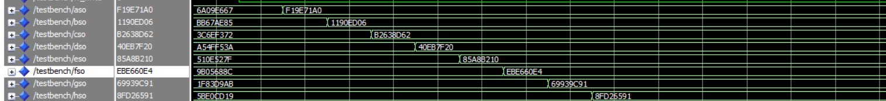
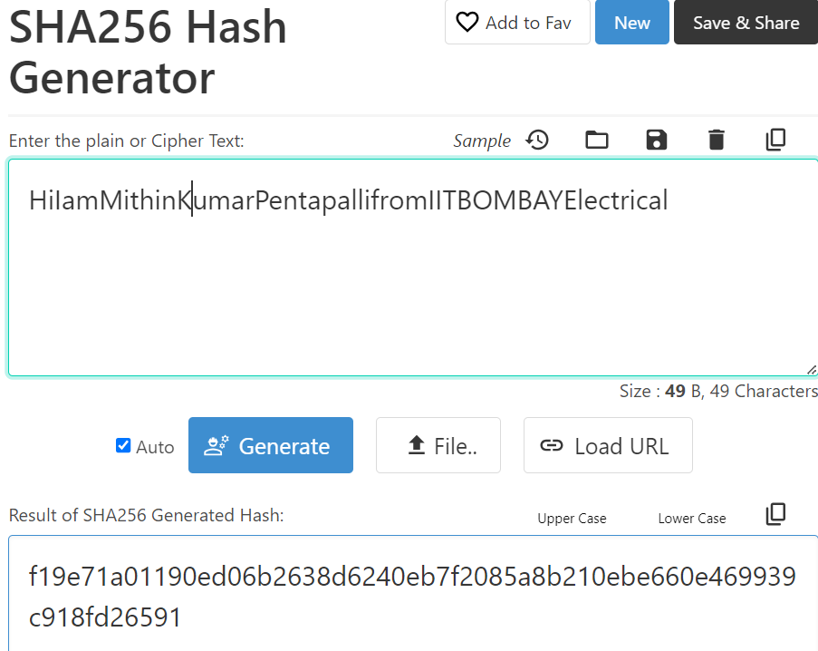

# Pipelined SHA-256 Algorithm with Multimem Architecture

## Overview

This project implements a high-performance SHA-256 accelerator using a pipelined architecture with multiple memory blocks, inspired by the IEEE paper "A High-Performance Multimem SHA-256 Accelerator for Society 5.0." The architecture efficiently calculates 4 hash values in 256 cycles, excluding the initial load cycles.

## Features

- **Pipelined Architecture**: Ensures high throughput by overlapping the processing of multiple data blocks.
- **Multimem Architecture**: Utilizes multiple memory blocks to handle intermediate data efficiently.
- **Parallel Execution (PE) Block**: Implements the core processing element as described in the paper.

## Implementation Details

### Components

1. **PE Block**: The core processing element that performs the main hashing computations.
2. **Memory Blocks**: Handle intermediate data storage and facilitate parallel processing.
3. **Control Unit**: Manages the data flow and synchronization between the PE blocks and memory.

### Performance

- **Hash Calculation**: Capable of computing 4 hash values in 256 cycles (excluding initial load cycles).
- **Latency**: Initial load cycles are not included in the main computation cycles, ensuring efficient processing.

## Results

### Image 1: Timing Diagram

### Image 2: Resource Utilization

## References

- IEEE Paper: [A High-Performance Multimem SHA-256 Accelerator for Society 5.0](https://ieeexplore.ieee.org/document/XXXXXXX)

## Acknowledgements

Special thanks to the authors of the IEEE paper for their insightful research and contributions to the field.

---

Replace the placeholder paths for the images with the actual paths to your images. This README provides a comprehensive overview of your project along with visual results.
